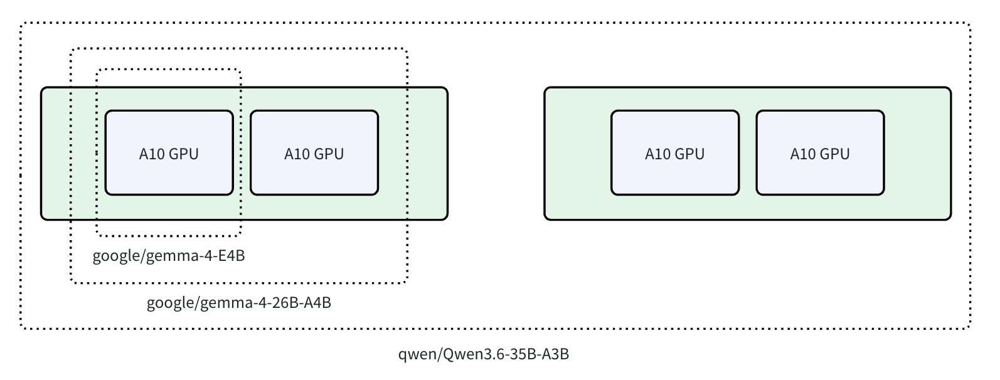

# vLLM Learning

1. LeaderWorkerSet https://github.com/kubernetes-sigs/lws is an API created by a Kubernetes special interest group that aims to address the common patterns of deploying LLM on top of Kubernetes, especially multi-node LLM sharding.
2. When we are deploying LLM across multiple nodes, if 1 node fails due to OOM, electricity, etc. the whole group that hosts the model needs to be restarted. LeaderWorkerSet aims to handle this kind of operation.
3. why multiple-node LLM deployment? a single GPU has limited memory capacity. smaller parameter models can be deployed in a single GPU, some can be deployed in multiple GPUs inside one physical host, larger models need to be deployed and sharded across multiple physical hosts.



4. most LLMs (large language models) today are based on the Transformer architecture, specifically the decoder-only variants popularized by GPT (Generative Pre-trained Transformer) https://jalammar.github.io/illustrated-transformer/ (even I am still confused right now haha)
5. The Transformer architecture consists of multiple layers where there are attention sublayers and feed-forward network sublayers. multi-gpu or multi-node LLM deployment works by distributing the layers across the GPUs

```
Node 1 GPU 1: layers 0-7
Node 1 GPU 2: layers 8-15
Node 2 GPU 1: layers 16-23
Node 2 GPU 2: layers 24-31
```
this is only one example (pipeline parallelism) on how to distribute computational workload of AI models

6. when deploying a model that would not be able to fit into 1 GPU, there are several ways to make it work:
- quantization
- pruning
- distillation
- parallelism https://www.infracloud.io/blogs/inference-parallelism/

7. Inference parallelism aims to distribute the computational workload of AI models. there are several methods
- Tensor Parallelism
- Pipeline Parallelism
- Expert Parallelism

8. Pipeline Parallelism distributes the layers across multiple GPUs. if a model requires 200 GB of GPU memory, with 4-way Pipeline Parallelism, we can distribute the workload to GPUs with only 50 GB of memory each.

```
Node 1 GPU 0: layers 0-7
Node 1 GPU 1: layers 8-15
Node 1 GPU 2: layers 16-23
Node 1 GPU 3: layers 24-31
```
there is overhead with pipeline parallelism where GPU 2 needs to wait for the output of GPU 1.

9. Tensor Parallelism keeps all layers on all GPUs, but each GPU only stores a subset of the columns (or rows) of the weight matrices, eventually reducing the GPU memory needed per device.
```
Node 1 GPU 0: layers 0-31 but only columns 0-1024    (all layers, subset of columns)
Node 1 GPU 1: layers 0-31 but only columns 1024-2048
Node 1 GPU 2: layers 0-31 but only columns 2048-3072
Node 1 GPU 3: layers 0-31 but only columns 3072-4096
```
but all GPUs require a faster communication channel. use Tensor Parallelism if GPU communication can be fast (NVLink or InfiniBand)

10. always check nvidia-smi topo -m before deciding parallelism strategy.

11. nvidia-smi can output a topology of the GPUs inside the node. it shows how the GPUs communicate with each other. NV means NVLink connection.

```
nvidia-smi topo -m
        GPU0    GPU1    GPU2    GPU3    CPU Affinity    NUMA Affinity
GPU0     X      NV2     NV1     NV1     0-23            0
GPU1    NV2      X      NV1     NV1     0-23            0
GPU2    NV1     NV1      X      NV2     24-47           1
GPU3    NV1     NV1     NV2      X      24-47           1
```

